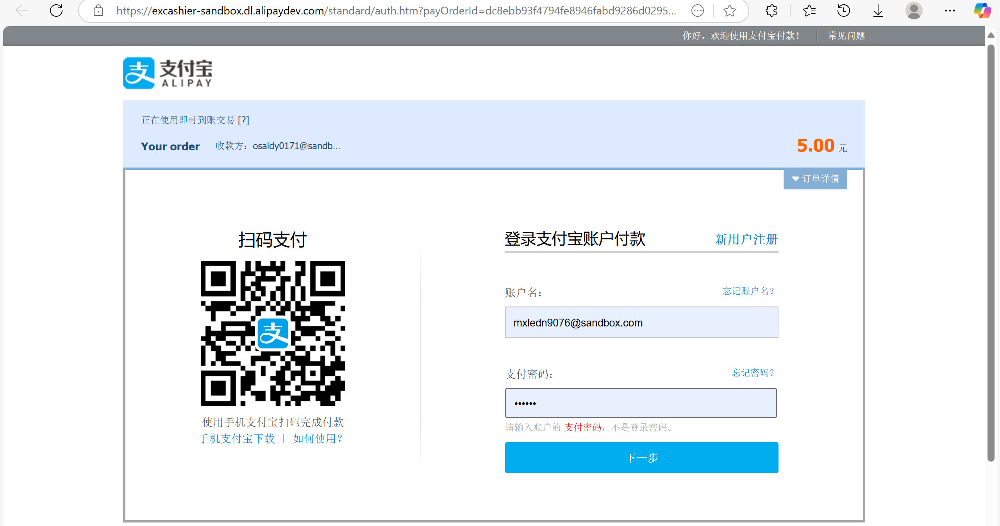
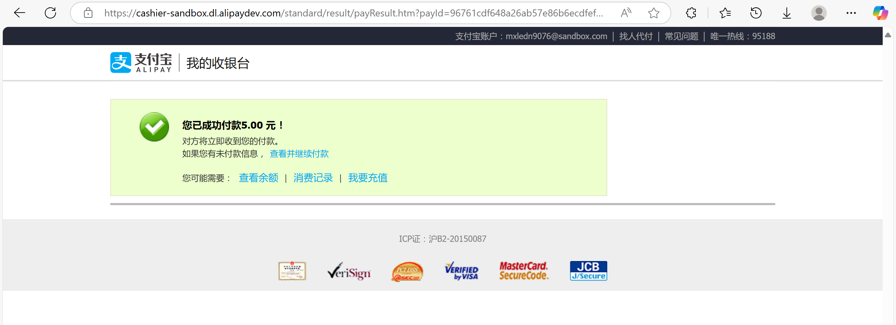
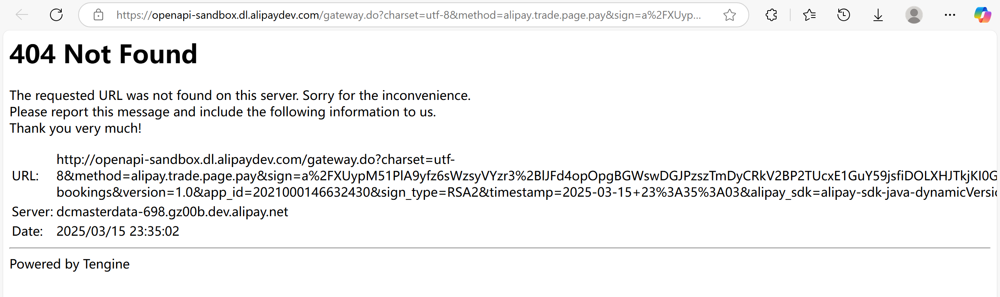

## API Documentation

### Authentication API

#### User Registration

- **URL**: `/api/auth/register`
- **Method**: `POST`
- **Request Body**:
  ```json
  {
    "username": "string",     // 3-20 characters, letters, numbers and underscore only
    "password": "string",     // Min 8 chars, must contain uppercase, lowercase and number
    "email": "string",        // Valid email format
    "mobile": "string",       // 10-13 digits
    "birthday": "date"        // Format: YYYY-MM-DD, must be in the past
                             // Will be used to automatically determine discount eligibility
     "bankCard": "string"    //13-16 digits
  }
  ```
- **Success Response** (200 OK):
  ```json
  {
    "message": "User registered successfully",
    "userId": "number",
    "username": "string",
    "isStudent": "number",    // 1: yes, 0: no
    "isSenior": "number"      // 1: yes, 0: no
  }
  ```
- **Error Response** (400 Bad Request):
  ```json
  {
    "username": "error message",
    "password": "error message",
    "email": "error message",
    "mobile": "error message",
    "birthday": "error message"
  }
  or
  {
      "username already exists"
  }
  or 
  {
      "Email already exists"
  }
  or
  {
      "Bankcard already exists"
  }
  ```

#### User Login

- **URL**: `/api/auth/login`

- **Method**: `POST`

- **Request Body**:
  ```json
  {
    "username": "string",
    "password": "string",
    "captchaKey": "string",
    "captcha": "string"
  }
  ```

- **Success Response** (200 OK):
  ```json
  {
    "message": "Login successful",
    "userId": "number",
    "username": "string",
    "userType": "number",
    "email": "string",
    "token": "string"
  }
  ```

- **Error Response** (400 Bad Request):
  ```json
  {
    "username": "error message",
    "password": "error message",
    "captcha": "error message"
  }
  ```
  或
  ```json
  "Login failed: error message"
  ```
  或
  ```json
  "验证码错误"
  ```

- **Error Response** (403Forbidden): [When user.status==0]

  ```
  "You do not have permission to log in, please contact the platform."
  ```

  ​

#### Get Captcha

- **URL**: `/api/auth/captcha`
- **Method**: `GET`
- **Success Response** (200 OK):
  ```json
  {
    "captchaKey": "string",
    "captchaImageBase64": "string"
  }
  ```

#### Validate Token

- **URL**: `/api/auth/validate`
- **Method**: `GET`
- **Headers**:
  ```
  Authorization: Bearer {token}
  ```
- **Success Response** (200 OK):
  ```json
  {
    "valid": true,
    "userId": "number",
    "username": "string",
    "userType": "number"
  }
  ```
- **Error Response** (400 Bad Request):
  ```json
  "Invalid or missing token"
  ```
  或
  ```json
  "Invalid token"
  ```
  或
  ```json
  "Token validation failed: error message"
  ```

#### Forgot Password

- **URL**: `/api/auth/forgot-password`
- **Method**: `POST`
- **Request Body**:
  ```json
  {
    "email": "string"
  }
  ```
- **Success Response** (200 OK):
  ```json
  {
    "message": "重置验证码已发送到您的邮箱"
  }
  ```
- **Error Response** (400 Bad Request):
  ```json
  {
    "error": "邮箱不存在"
  }
  ```
  或
  ```json
  {
    "email": "error message"
  }
  ```

#### Reset Password

- **URL**: `/api/auth/reset-password`
- **Method**: `POST`
- **Request Body**:
  ```json
  {
    "email": "string",
    "resetCode": "string",
    "newPassword": "string"
  }
  ```
- **Success Response** (200 OK):
  ```json
  {
    "message": "密码重置成功"
  }
  ```
- **Error Response** (400 Bad Request):
  ```json
  {
    "error": "验证码错误或已过期"
  }
  ```
  或
  ```json
  {
    "email": "error message",
    "resetCode": "error message",
    "newPassword": "error message"
  }
  ```

###User API

#### view my own bookings

- **URL**: `/api/users/orders/{userId}`

- **Method**: `GET`

- **Success Response** (200 OK):

  ```
  [
      {
          "id": 1,
          "orderTime": "2025-03-12T17:11:05.000+00:00",
          "status": 1,
          "startTime": "2025-03-12T17:20:00.000+00:00",
          "endTime": "2025-03-12T18:20:00.000+00:00",
          "hirePeriod": "HOUR",
          "price_before_discount": 5.00,
          "price": 5.00,
          "user": {
              "id": 2,
              "username": "user",
              "password": "$2a$10$5pscTMMTiM1NoWwzL//69u7NO07t7UsAPGdeMqZvd3TQ8oEARrspG",
              "avatar": "default_avatar.jpg",
              "birthday": "1995-05-05",
              "userType": 0,
              "mobile": "9876543210",
              "email": "user@example.com",
              "status": 1,
              "role": 1,
              "isFrequentUser": 0
          },
          "scooter": {
              "id": 1,
              "priceHour": 5.00,
              "priceFourHour": 10.00,
              "priceDay": 20.00,
              "priceWeek": 100.00,
              "status": 0,
              "battery": 100.00,
              "speed": 50.00,
              "store": {
                  "id": 1,
                  "longitude": 103.984500,
                  "latitude": 30.765000
              }
          }
      }
  ]
  ```

#### get all users

- **URL**: `/api/users/getAll`

- **Method**: `GET`

- **Success Response** (200 OK):

  ```
  [
      {
          "id": 1,
          "username": "admin",
          "email": "admin@example.com",
          "mobile": "1234567890",
          "avatar": "default_avatar.jpg",
          "birthday": "1990-01-01",
          "userType": 0,
          "status": 1,
          "role": 0,
          "hasBankCard": true,
          "maskedBankCard": "**** **** **** 2222",
          "bankBalance": 5000.00,
          "isStudent": 0,
          "isSenior": 0,
          "isFrequentUser": 0,
          "avatarUrl": "/uploads/avatars/default_avatar.jpg"
      },
      {
          "id": 2,
          "username": "user",
          "email": "user@example.com",
          "mobile": "9876543210",
          "avatar": "avatar_2_9483cf59-8bcb-4784-abb2-4f94cf9a8376.jpg",
          "birthday": "1995-05-05",
          "userType": 0,
          "status": 1,
          "role": 1,
          "hasBankCard": true,
          "maskedBankCard": "**** **** **** 1111",
          "bankBalance": 3442.89,
          "isStudent": 0,
          "isSenior": 0,
          "isFrequentUser": 0,
          "avatarUrl": "/uploads/avatars/avatar_2_9483cf59-8bcb-4784-abb2-4f94cf9a8376.jpg"
      }
  ]
  ```

####Change status of a user [only admin]

- **URL**: `/api/users/changeStatus/{id}`

- **Method**: `Get`

- **Success Response** (200 OK):

  ```
  {
      "id": 2,
      "username": "user",
      "password": "$2a$10$pfvdfutJj.b/NloLAgOos.sOAgkJXH3uKAIasXfgAMNEpfzGG3Uni",
      "avatar": "default_avatar.jpg",
      "birthday": "1995-05-05",
      "userType": 0,
      "mobile": "9876543210",
      "email": "user@example.com",
      "status": 0,
      "role": 1,
      "isFrequentUser": 0,
      "isStudent": 0,
      "isSenior": 0
  }
  ```

#### Update Bank Card Information

- **URL**: `/api/users/updateBankCard/{userId}`

- **Method**: `POST`

- **Headers**:
  ```
  Authorization: Bearer {token}
  ```

- **Request Body**:
  ```json
  {
    "bankCard": "string"    // 13-19 digits
  }
  ```

- **Success Response** (200 OK):
  ```json
  {
    "message": "Bank card information updated successfully",
    "userId": "number",
    "bankCard": "string"
  }
  ```

- **Error Response** (400 Bad Request):
  ```json
  "User not found with id: {userId}"
  ```
  或
  ```json
  "Failed to update bank card information: error message"
  ```

#### Check Bank Card

- **URL**: `/api/bank-payment/check-card/{userId}`
- **Method**: `GET`
- **Headers**:
  ```
  Authorization: Bearer {token}
  ```
- **Path Parameters**:
  - `userId`: User ID
- **Success Response** (200 OK):
  ```json
  {
    "hasBankCard": true,
    "maskedCard": "**** **** **** 1234",
    "bankBalance": 5000.00
  }
  ```
- **Error Response** (400 Bad Request):
  ```json
  {
    "message": "User not found"
  }
  ```

#### Bank Card Payment (with Deposit)

- **URL**: `/api/bank-payment/{orderId}`
- **Method**: `POST`
- **Headers**:
  ```
  Authorization: Bearer {token}
  Content-Type: application/json
  ```
- **Path Parameters**:
  - `orderId`: Order ID
- **Request Body**:
  ```json
  {
    "bankCard": "string"  // 卡号
  }
  ```
- **Success Response** (200 OK):
  ```json
  {
    "success": true,
    "message": "支付成功",
    "orderId": "number",
    "bankCardLast4": "string",
    "amount": "number",       // Total amount including deposit (50 yuan)
    "paymentTime": "datetime"
  }
  ```
- **Error Response** (400 Bad Request):
  ```json
  {
    "message": "银行卡余额不足，无法完成支付"
  }
  ```

#### Alipay Payment (without Deposit)

- **URL**: `/api/alipay-payment/{orderId}`
- **Method**: `POST`
- **Headers**:
  ```
  Authorization: Bearer {token}
  ```
- **Path Parameters**:
  - `orderId`: Order ID
- **Success Response** (200 OK):
  ```json
  {
    "success": true,
    "message": "支付宝支付成功",
    "orderId": "number",
    "amount": "number",       // Only order price, no deposit
    "paymentTime": "datetime"
  }
  ```
- **Error Response** (400 Bad Request):
  ```json
  {
    "message": "订单状态不正确，无法支付"
  }
  ```

#### new bank card pay

- **URL**: `/api/bank-payment/newCard/{orderId}`

- **Method**: `POST`

- **Request Body**:

  ```
  {
    "bankCard": "string"  // 卡号
  }
  ```

  **Success Response** (200 OK):

  ```
  {
      "message": "Bank card payment successful"
  }
  ```

  **Error Response**:

  ```
  {
  	"Order not found"
  }
  or
  {
      "Invalid order status, cannot process payment"
  }
  ```

  ​

#### Return Scooter

- **URL**: `/api/bookings/return`
- **Method**: `POST`
- **Headers**:
  ```
  Authorization: Bearer {token}
  Content-Type: application/json
  ```
- **Request Body**:
  ```json
  {
    "orderId": "number",
    "remarks": "string"       // Optional remarks
  }
  ```
- **Success Response** (200 OK):
  ```json
  {
    "message": "电动车归还成功",
    "orderId": "number",
    "returnTime": "datetime",
    "depositRefunded": "boolean",
    "depositAmount": "number",      // Included if depositRefunded is true
    "depositMessage": "string"      // Included if depositRefunded is true
  }
  ```
- **Error Response** (400 Bad Request):
  ```json
  {
    "message": "只有活跃订单才能进行还车操作"
  }
  ```

#### change password

- **URL**: `/api/users/changePassword/{userId}`

- **Method**: `POST`

- **Request Body**:

  ```
  {
      "oldPassword": string,
      "newPassword":string，must consist at least 8 characters, including at least one capital letter, one lowercase letter and one digit,
      "confirmPassword": string,要和newPassword一样
  }
  ```

  **Success Response** (200 OK):

  ```
  {
      "message": "Successfully modify password",
  	"userId": userId
  }
  ```

  **Error Response** (400 Bad Request):

  ```
  {
      "The new password and the confirmed password do not match"
  }
  OR
  {
      "Password modification failed. The old password might be incorrect"
  }
  OR
  {
      "Password modification failed: " + e.getMessage()
  }
  ```

#### get one user

- **URL**: `/api/users/profile/{userId}`

- **Method**: `Get`

- **Success Response(200 OK)** 

  ```
  {
      "id": 2,
      "username": "user",
      "email": "user@example.com",
      "mobile": "9876543210",
      "avatar": "avatar_2_9483cf59-8bcb-4784-abb2-4f94cf9a8376.jpg",
      "birthday": "1995-05-05",
      "userType": 0,
      "status": 1,
      "role": 1,
      "hasBankCard": true,
      "maskedBankCard": "**** **** **** 1111",
      "bankBalance": 3442.89,
      "isStudent": 0,
      "isSenior": 0,
      "isFrequentUser": 0,
      "avatarUrl": "/uploads/avatars/avatar_2_9483cf59-8bcb-4784-abb2-4f94cf9a8376.jpg"
  }
  ```

#### modify bankcard

- **URL**: `/api/users//updateBankCard/{userId}`

- **Method**: `Post`

- **Request Body**:

  ```
  {
      "bankCard": "11111111111112"
  }

  ```

- **Success Response(200 OK)** 

  ```
  {
      "bankCard": "11111111111112",
      "message": "Bank card information updated successfully",
      "userId": 2
  }
  ```

- Error(400Bad Request)

  ```
  {
   "Failed to update bank card information: " + e.getMessage()   
  }
  ```

  ​

### Store API

#### add store

- **URL**: `/api/stores/add`

- **Method**: `POST`

- **Request Body**:

  ```
  {
      "name": "store 4",
      "longitude": 100.000000,
      "latitude": 10
  }
  ```

- **Success Response(200 OK)** 

  ```
  {
      "latitude": 10,
      "name": "store 4",
      "message": "Add successfully",
      "storeId": 4,
      "longitude": 100.000000
  }
  ```

- **Error(400Bad Request)**

  ```
  {
      "latitude": "The latitude of the location is required"
  }

  or 

  {
      "name": "The name of the store is required"
  }
  ```

#### get all

- **URL**: `/api/stores/getAll`

- **Method**: `GET`

- **Success Response** (200 OK):

  ```
  [
      {
          "id": 1,
          "name": "store 1",
          "longitude": 103.984500,
          "latitude": 30.765000
      },
      {
          "id": 2,
          "name": "store 2",
          "longitude": 103.987000,
          "latitude": 30.764000
      },
      {
          "id": 3,
          "name": "store 3",
          "longitude": 103.986500,
          "latitude": 30.766000
      },
      {
          "id": 4,
          "name": "store 4",
          "longitude": 100.000000,
          "latitude": 10.000000
      }
  ]
  ```

#### get one

- **URL**: `/api/stores/1`
- **Method**: `GET`
- **Success Response** (200 OK):

```
{
    "id": 1,
    "name": "store 1",
    "longitude": 103.984500,
    "latitude": 30.765000
}
```

#### 距离最近的5个店铺

- **URL**: `/api/stores/nearby?longitude=103.984500&latitude=30.765000`

- **Method**: `GET`

- **Success Response** (200 OK):

  PS: 返回的distance单位是km，若店铺数量不足5个，就返回所有店铺

  ```
  [
      {
          "distance": 0.0,
          "store": {
              "id": 1,
              "name": "store 1",
              "longitude": 103.984500,
              "latitude": 30.765000
          }
      },
      {
          "distance": 0.2210896980664518,
          "store": {
              "id": 3,
              "name": "store 3",
              "longitude": 103.986500,
              "latitude": 30.766000
          }
      },
      {
          "distance": 0.26348108677786547,
          "store": {
              "id": 2,
              "name": "store 2",
              "longitude": 103.987000,
              "latitude": 30.764000
          }
      }
  ]
  ```

  ​

###  Scooter API

#### Add scooter

- **URL**: `/api/scooters/add`

- **Method**: `POST`

- **Request Body**:
  ```json
  {
    "priceHour": "decimal",
    "priceFourHour": "decimal",
    "priceDay": "decimal",
    "priceWeek": "decimal",
    "status": "int",
    "battery": "decimal",
    "speed": "decimal",
    "storeId": "int",
  }
  ```

- **Success Response** (200 OK):
  ```json
  {
    "message": "Add successful",
    "scooterId": "int"
  }
  ```
- **Error Response** (400 Bad Request):
  ```json
  {
      "message": "error message"
  }
  ```


#### get all scooters in database

**URL**: `/api/scooters/getAll`

**Method**: `Get`

**Success Response** (200 OK):

```
[
    {
        "id": 1,
        "priceHour": 5.00,
        "priceFourHour": 10.00,
        "priceDay": 20.00,
        "priceWeek": 100.00,
        "status": 1,
        "battery": 100.00,
        "speed": 100.00,
        "store": {
            "id": 1,
            "longitude": 103.984500,
            "latitude": 30.765000
        }
    },
    {
        "id": 2,
        "priceHour": 5.00,
        "priceFourHour": 10.00,
        "priceDay": 20.00,
        "priceWeek": 100.00,
        "status": 1,
        "battery": 50.00,
        "speed": 50.00,
        "store": {
            "id": 2,
            "longitude": 103.984500,
            "latitude": 30.765000
        }
    }
]
```

#### get available scooters in a store with discount (has battery and no conflict order)

**URL**: `/api/scooters/getScootersAvailable/{userId}/{storeId}`

**method**: `POST`

**Request Body** : 

```
{
    "hireType": "string",     // One of: "HOUR", "FOUR_HOURS", "DAY", "WEEK"
  	"startTime": "string"     // Format: "YYYY-MM-DD HH:mm:ss"
}
```

**Success Response** (200 OK):

```
[
    {
        "id": 2,
        "status": 1,
        "priceHour": 5.00,
        "priceFourHour": 10.00,
        "priceDay": 20.00,
        "priceWeek": 100.00,
        "discountedPriceHour": 5.00,
        "discountedPriceFourHour": 10.00,
        "discountedPriceDay": 20.00,
        "discountedPriceWeek": 100.00,
        "hasDiscount": true,
        "speed": 100.00,
        "battery": 100.00
    }
]
```

#### get all scooters in one store

**URL**: `/api/scooters/{storeId}`

**method**:`Get`

**Success Response** (200 OK)

```
[
    {
        "id": 1,
        "priceHour": 5.00,
        "priceFourHour": 10.00,
        "priceDay": 20.00,
        "priceWeek": 100.00,
        "status": 1,
        "battery": 100.00,
        "speed": 100.00,
        "store": {
            "id": 1,
            "name": "store 1",
            "longitude": 103.984500,
            "latitude": 30.765000
        }
    },
    {
        "id": 2,
        "priceHour": 5.00,
        "priceFourHour": 10.00,
        "priceDay": 20.00,
        "priceWeek": 100.00,
        "status": 1,
        "battery": 50.00,
        "speed": 50.00,
        "store": {
            "id": 1,
            "name": "store 1",
            "longitude": 103.984500,
            "latitude": 30.765000
        }
    }
]
```


#### change status: valid to invalid or invalid to valid

**URL**: `/api/scooters/changeStatus/{id}`

**method**:`Get`

**Success Response** (200 OK)

#### edit scooter information

**URL**: `/api/scooters/update/{id}`

**method**:`Put`

**Request Body** : 

```
{
    "priceHour": 11.00,
    "priceFourHour": 10.00,
    "priceDay": 20.00,
    "priceWeek": 100.00,
    "status": 1,
    "battery": 50.00,
    "speed": 20.00,
    "storeId":  1
}
```

**Success Response** (200 OK)

```
{
    "No changes detected"
}
or
{
    "Scooter updated successfully"
}
or
{
    每一个表单相应的报错
}
```


### Booking API

#### Create Booking

- **URL**: `/api/bookings`
- **Method**: `POST`
- **Request Body**:
  ```json
  {
    "userId": "number",       // User ID
    "scooterId": "number",    // Scooter ID
    "hireType": "string",     // One of: "HOUR", "FOUR_HOURS", "DAY", "WEEK"
    "startTime": "string"     // Format: "YYYY-MM-DD HH:mm:ss"
  }
  ```
- **Success Response** (200 OK):
  ```
  {
    "orderId": 1,
    "priceBeforeDiscount": 5.00,
    "price": 5.00,
    "startTime": "2025-04-21T16:00:00.000+00:00",
    "endTime": "2025-04-21T17:00:00.000+00:00",
    "message": "Booking successful"
  }
  ```

  ​

#### Get All bookings (only admin can) 

- **URL**: `/api/bookings/getAll`

- **Method**: `GET`

- **Success Response** (200 OK):

  ```
  [
      {
          "id": 1,
          "orderTime": "2025-03-12T17:11:05.000+00:00",
          "status": 1,
          "startTime": "2025-03-12T17:20:00.000+00:00",
          "endTime": "2025-03-12T18:20:00.000+00:00",
          "hirePeriod": "HOUR",
          "price_before_discount": 5.00,
          "price": 5.00,
          "user": {
              "id": 2,
              "username": "user",
              "password": "$2a$10$5pscTMMTiM1NoWwzL//69u7NO07t7UsAPGdeMqZvd3TQ8oEARrspG",
              "avatar": "default_avatar.jpg",
              "birthday": "1995-05-05",
              "userType": 0,
              "mobile": "9876543210",
              "email": "user@example.com",
              "status": 1,
              "role": 1,
              "isFrequentUser": 0
          },
          "scooter": {
              "id": 1,
              "priceHour": 5.00,
              "priceFourHour": 10.00,
              "priceDay": 20.00,
              "priceWeek": 100.00,
              "status": 0,
              "battery": 100.00,
              "speed": 50.00,
              "store": {
                  "id": 1,
                  "longitude": 103.984500,
                  "latitude": 30.765000
              }
          },
          "staff": {
              "id": 1,
              "username": "admin",
              "password": "$2a$10$pfvdfutJj.b/NloLAgOos.sOAgkJXH3uKAIasXfgAMNEpfzGG3Uni",
              "avatar": "default_avatar.jpg",
              "birthday": "1990-01-01",
              "userType": 0,
              "mobile": "1234567890",
              "email": "admin@example.com",
              "status": 1,
              "role": 0,
              "isFrequentUser": 0,
              "isStudent": 0,
              "isSenior": 0
          }
      }
  ]
  ```

#### Get One booking by id

- **URL**: `/api/bookings/{orderId}`

- **Method**: `GET`

- **Path Parameters**:

  - `orderId`: ID of the order


- **An example of Success Response** (200 OK):

  ```
  {
      "id": 1,
      "orderTime": "2025-03-12T17:11:05.000+00:00",
      "status": 2,
      "startTime": "2025-03-12T17:20:00.000+00:00",
      "endTime": "2025-03-12T18:20:00.000+00:00",
      "hirePeriod": "HOUR",
      "price_before_discount": 5.00,
      "price": 5.00,
      "user": {
          "id": 3,
          "username": "dejavu",
          "password": "$2a$10$2ECPgQqk59EEFmUb6iVeAOp8rq1tkWJlTNj1xaRyp9/vfEoYuc8Uy",
          "avatar": "default_avatar.jpg",
          "birthday": "2022-06-02",
          "userType": 0,
          "mobile": "15806120102",
          "email": "2079815209@qq.com",
          "status": 1,
          "role": 1,
          "isFrequentUser": 0
      },
      "scooter": {
          "id": 1,
          "priceHour": 5.00,
          "priceFourHour": 10.00,
          "priceDay": 20.00,
          "priceWeek": 100.00,
          "status": 0,
          "battery":100.00,
          "speed": 50.00,
          "store": {
              "id": 1,
              "longitude": 103.984500,
              "latitude": 30.765000
          }
      },
      "staff": {
          "id": 1,
          "username": "admin",
          "password": "$2a$10$pfvdfutJj.b/NloLAgOos.sOAgkJXH3uKAIasXfgAMNEpfzGG3Uni",
          "avatar": "default_avatar.jpg",
          "birthday": "1990-01-01",
          "userType": 0,
          "mobile": "1234567890",
          "email": "admin@example.com",
          "status": 1,
          "role": 0,
          "isFrequentUser": 0,
          "isStudent": 0,
          "isSenior": 0
      }
  }
  ```

#### get Orders that have not been started

- **URL**: `/api/bookings/getAllUndo/{userId}`

- **Method**: `GET`

- **Path Parameters**:

  - `orderId`: ID of the user

- **Success Response** (200 OK):

  1. 用户没有未开始的订单

  ```
  []
  ```

  2. 用户有未开始的订单

  ```
  [
      {
          "id": 2,
          "orderTime": "2025-04-15T03:00:02.000+00:00",
          "status": 1,
          "startTime": "2025-04-28T14:01:00.000+00:00",
          "endTime": "2025-04-29T14:01:00.000+00:00",
          "hirePeriod": "DAY",
          "price": 20.00,
          "user": {
              "id": 2,
              "username": "user",
              "password": "$2a$10$pfvdfutJj.b/NloLAgOos.sOAgkJXH3uKAIasXfgAMNEpfzGG3Uni",
              "avatar": "default_avatar.jpg",
              "birthday": "1995-05-05",
              "userType": 0,
              "mobile": "9876543210",
              "email": "user@example.com",
              "status": 1,
              "role": 1,
              "isFrequentUser": 0,
              "isStudent": 0,
              "isSenior": 0
          },
          "scooter": {
              "id": 2,
              "priceHour": 5.00,
              "priceFourHour": 10.00,
              "priceDay": 20.00,
              "priceWeek": 100.00,
              "status": 1,
              "battry": 100.00,
              "speed": 50.00,
              "store": {
                  "id": 1,
                  "longitude": 103.984500,
                  "latitude": 30.765000
              }
          },
          "staff": null,
          "priceBeforeDiscount": 20.00
      }
  ]
  ```

#### get Orders that are ongoing

- **URL**: `/api/bookings/getAllOngoing/{userId}`

- **Method**: `GET`

- **Path Parameters**:

  - `orderId`: ID of the user

- **Success Response** (200 OK):

  1. 用户没有正在进行的订单

  ```
  []
  ```

  2. 用户有正在进行的订单

  ```
  [
      {
          "id": 2,
          "orderTime": "2025-04-15T03:00:02.000+00:00",
          "status": 1,
          "startTime": "2025-04-14T14:01:00.000+00:00",
          "endTime": "2025-04-15T14:01:00.000+00:00",
          "hirePeriod": "DAY",
          "price": 20.00,
          "user": {
              "id": 2,
              "username": "user",
              "password": "$2a$10$pfvdfutJj.b/NloLAgOos.sOAgkJXH3uKAIasXfgAMNEpfzGG3Uni",
              "avatar": "default_avatar.jpg",
              "birthday": "1995-05-05",
              "userType": 0,
              "mobile": "9876543210",
              "email": "user@example.com",
              "status": 1,
              "role": 1,
              "isFrequentUser": 0,
              "isStudent": 0,
              "isSenior": 0
          },
          "scooter": {
              "id": 2,
              "priceHour": 5.00,
              "priceFourHour": 10.00,
              "priceDay": 20.00,
              "priceWeek": 100.00,
              "status": 1,
              "battery":100.00,
              "speed": 50.00,
              "store": {
                  "id": 1,
                  "longitude": 103.984500,
                  "latitude": 30.765000
              }
          },
          "staff": null,
          "priceBeforeDiscount": 20.00
      }
  ]
  ```

#### get Orders that are finished

- **URL**: `/api/bookings/getAllFinished/{userId}`

- **Method**: `GET`

- **Path Parameters**:

  - `orderId`: ID of the user

- **Success Response** (200 OK):

  1. 用户没有已结束的订单

  ```
  []
  ```

  2. 用户有已结束的订单

  ```
  [
      {
          "id": 2,
          "orderTime": "2025-04-15T03:00:02.000+00:00",
          "status": 1,
          "startTime": "2025-04-13T14:01:00.000+00:00",
          "endTime": "2025-04-14T14:01:00.000+00:00",
          "hirePeriod": "DAY",
          "price": 20.00,
          "user": {
              "id": 2,
              "username": "user",
              "password": "$2a$10$pfvdfutJj.b/NloLAgOos.sOAgkJXH3uKAIasXfgAMNEpfzGG3Uni",
              "avatar": "default_avatar.jpg",
              "birthday": "1995-05-05",
              "userType": 0,
              "mobile": "9876543210",
              "email": "user@example.com",
              "status": 1,
              "role": 1,
              "isFrequentUser": 0,
              "isStudent": 0,
              "isSenior": 0
          },
          "scooter": {
              "id": 2,
              "priceHour": 5.00,
              "priceFourHour": 10.00,
              "priceDay": 20.00,
              "priceWeek": 100.00,
              "status": 1,
              "battery":100.00,
              "speed": 50.00,
              "store": {
                  "id": 1,
                  "longitude": 103.984500,
                  "latitude": 30.765000
              }
          },
          "staff": null,
          "priceBeforeDiscount": 20.00
      }
  ]
  ```

#### Cancel booking

- **URL**: `/api/bookings/cancel/{orderId}`

- **Method**: `POST`

- **Path Parameters**:

  - `orderId`: ID of the order

- **Success Response** (200 OK):

  ```
  {
      "message": "Booking cancelled successfully"
  }
  ```


- **Error Response** (400 Bad Request):

  ```
  {
      "message": "Order is already cancelled"
  }
  ```

#### Extend booking

- **URL**: `/api/bookings/extend/{orderId}`

- **Method**: `POST`

- **Path Parameters**: `orderId`: ID of the order

- **Request Body**:

  ```
  {
    "hireType": "string",     // One of: "HOUR", "FOUR_HOURS", "DAY", "WEEK"
  }
  ```

- **Success Response** (200 OK):

  ```
  {
    "message": "Booking successful",
    "orderId": "number",
    "startTime": "string",
    "endTime": "string",
    "priceBeforeDiscount": "decimal",
    "price": "decimal"
  }
  ```

#### Create Booking for unregistered users （only admin）

1. register the user, see 7.1.1

2. create book

   **URL**: `/api/bookings/forUnregistered`

   **Method**: `POST`

   **Request Body**:

   ```
   {
     "userId": "number",       // User ID
     "scooterId": "number",    // Scooter ID
     "hireType": "string",     // One of: "HOUR", "FOUR_HOURS", "DAY", "WEEK"
     "startTime": "string",     // Format: "YYYY-MM-DD HH:mm:ss"
     "staffId": "number"
   }
   ```

   **Success Response** (200 OK):

   ```
   {
       "orderId": 1,
       "priceBeforeDiscount": 5.00,
       "price": 5.00,
       "startTime": "2025-04-21T16:00:00.000+00:00",
       "endTime": "2025-04-21T17:00:00.000+00:00",
       "message": "Booking successful"
   }
   ```

3. pay: see 7.2.6（银行卡） + 7.8.1(沙盒)

### Email Notifications

The system automatically sends email confirmations for successful bookings. The email includes:
- Booking confirmation message
- Order ID
- Battery and Speed
- Start and end times
- Rental duration
- Rental fee
- Contact information

### Feedback API

#### Create Feedback

- **URL**: `/api/feedback`
- **Method**: `POST`
- **Headers**:
  ```
  Authorization: Bearer {token}
  ```
- **Request Body**:
  ```json
  {
    "content": "string"    // Feedback content
  }
  ```
- **Success Response** (200 OK):
  ```json
  {
    "id": "number",
    "userId": "number",
    "content": "string",
    "createTime": "datetime",
    "status": "string",      // "pending", "processing", or "resolved"
    "priority": "number",    // 0: low, 1: medium, 2: high
    "adminResponse": "string",
    "responseTime": "datetime"
  }
  ```
- **Error Response** (400 Bad Request):
  ```json
  {
    "message": "Failed to create feedback: error message"
  }
  ```
- **Error Response** (401 Unauthorized):
  ```json
  {
    "error": "No access authorization"
  }
  ```

#### Get User's Feedbacks

- **URL**: `/api/feedback/user`
- **Method**: `GET`
- **Headers**:
  ```
  Authorization: Bearer {token}
  ```
- **Success Response** (200 OK):
  ```json
  [
    {
      "id": "number",
      "userId": "number",
      "content": "string",
      "createTime": "datetime",
      "status": "string",
      "priority": "number",
      "adminResponse": "string",
      "responseTime": "datetime"
    }
  ]
  ```
- **Error Response** (400 Bad Request):
  ```json
  {
    "message": "Failed to get feedbacks: error message"
  }
  ```
- **Error Response** (401 Unauthorized):
  ```json
  {
    "error": "No access authorization"
  }
  ```

#### Get All Feedbacks (Admin Only)

- **URL**: `/api/feedback/all`
- **Method**: `GET`
- **Headers**:
  ```
  Authorization: Bearer {token}
  ```
- **Success Response** (200 OK):
  ```json
  [
    {
      "id": "number",
      "userId": "number",
      "content": "string",
      "createTime": "datetime",
      "status": "string",
      "priority": "number",
      "adminResponse": "string",
      "responseTime": "datetime"
    }
  ]
  ```
- **Error Response** (401 Unauthorized):
  ```json
  {
    "error": "No access authorization"
  }
  ```
- **Error Response** (403 Forbidden):
  ```json
  {
    "error": "Permission denied"
  }
  ```

#### Update Feedback (Admin Only)

- **URL**: `/api/feedback/{id}`
- **Method**: `PUT`
- **Headers**:
  ```
  Authorization: Bearer {token}
  ```
- **Request Body**:
  ```json
  {
    "priority": "number",      // Optional, 0: low, 1: medium, 2: high
    "status": "string",        // Optional, "pending", "processing", or "resolved"
    "adminResponse": "string"  // Optional, admin's response to the feedback
  }
  ```
- **Success Response** (200 OK):
  ```json
  {
    "id": "number",
    "userId": "number",
    "content": "string",
    "createTime": "datetime",
    "status": "string",
    "priority": "number",
    "adminResponse": "string",
    "responseTime": "datetime"
  }
  ```
- **Error Response** (401 Unauthorized):
  ```json
  {
    "error": "No access authorization"
  }
  ```
- **Error Response** (403 Forbidden):
  ```json
  {
    "error": "Permission denied"
  }
  ```
- **Error Response** (400 Bad Request):
  ```json
  {
    "message": "Failed to update feedback: error message"
  }
  ```

### Pay Api 

#### web端

- **URL**: `/api/alipay/pay/{orderId}`

- **Method**: `GET`

- **Headers**:

  ```
  Authorization: Bearer {token}
  ```


- **Success**:

  ```
  <form name="punchout_form" method="post" action="https://openapi-sandbox.dl.alipaydev.com/gateway.do?charset=utf-8&method=alipay.trade.page.pay&sign=eONdSePeKIbGT2V0ZD6jt8WMEpBYxRu3nbjzIEv%2FdUIbLaIsT0ACiWhl9ewMM1rFuCdGmeDKDObFf8REFcCR4iTWt20%2Fm2GXUU0gX00tpRiWLEdecZnE%2Fx1O%2BujtYLfcDmoPetxZjjKafrkJkY4Z65Z%2FKzHIT0CyE0PbRQpgwZlm%2FO9lpvbgYYnd3Ds8kDux4RpnTlSlE5Gn4obDcaGUYt7CmFvPeUawak%2BaBIFGzSxT6OxDZtrXEqdPDXtSR2Nd5OiUN336YIdsPj9lK5HUUnKW2m0NdceltbR60wT6Lpqgm8JkKfAecsFTNurXAguHJwZSLDn4cXJNOihyvIjAvQ%3D%3D&return_url=http%3A%2F%2Flocalhost%3A5173%2Fmy-bookings&version=1.0&app_id=2021000146632430&sign_type=RSA2&timestamp=2025-03-24+15%3A46%3A21&alipay_sdk=alipay-sdk-java-dynamicVersionNo&format=JSON">
      <input type="hidden" name="biz_content" value="{&quot;body&quot;:&quot;This is your rent order&quot;,&quot;out_trade_no&quot;:&quot;1&quot;,&quot;product_code&quot;:&quot;FAST_INSTANT_TRADE_PAY&quot;,&quot;subject&quot;:&quot;Your order&quot;,&quot;total_amount&quot;:&quot;5.00&quot;}">
      <input type="submit" value="立即支付" style="display:none">
  </form>
  <script>
      document.forms[0].submit();
  </script>
  ```

  ​

情况一：如果订单还没有被支付（沙盒支付自己会判断），网址会自动跳转到如下支付页面

账户名：mxledn9076@sandbox.com

密码：111111



点击下一步，会继续跳转，再次输入密码111111


继续自动跳转，如下



过几秒后再次自动跳转，至全部订单页面（这个页面后续要改，改成个人中心全部订单的http）


情况二：如果orderId对应的订单已经被支付，网址会自动跳转到支付宝沙盒支付的固定页面，如下

**Fail**: 有时会失败，如下图3种情况，是自动跳转不稳定，刷新即可





#### App端

- **URL**: `/api/alipay/appPay/{orderId}`

- **Method**: `GET`

- **Headers**:

  ```
  Authorization: Bearer {token}

  ```


- **Success**:

```
alipay_sdk=alipay-sdk-java-dynamicVersionNo&app_id=2021000146632430&biz_content=%7B%22body%22%3A%22This+is+your+rent+order%22%2C%22out_trade_no%22%3A%221%22%2C%22product_code%22%3A%22FAST_INSTANT_TRADE_PAY%22%2C%22subject%22%3A%22Your+order%22%2C%22total_amount%22%3A%225.00%22%7D&charset=utf-8&format=JSON&method=alipay.trade.app.pay&return_url=http%3A%2F%2Flocalhost%3A5173%2Fmy-bookings&sign=fU9opIqEPq6yLErRgFAmDeaphmPr06Px1CeSq7s5yT8mS2ycdENv2plpjwrh4%2BZn1XKLTCzcCpLw61Zq%2FW%2BxhQ0ODFTCVAKGxaLUS7Q0%2Bznc%2B7LqbYLVqtw3narA%2FcyAfbSy3mPa3r9TOY6jmy5%2FGVPc1JK%2BV6it1LlLVNzJMA%2Fa07sLsAgGYaVsWiBe1IwBxZYfzFfIoPGDwdRasWJdTgNYd4Mimf3IjAD41j0614TRdQLsk90ScvrhLktdY35bP7KbkmHG%2Bv79KWDXkJ5qEMEcKNLc3uShi5cWEnJy3zNeiq7KSWoIqrr9GxAfN%2F9DyoJ69pansjan%2FvzAvvlv9g%3D%3D&sign_type=RSA2&timestamp=2025-03-25+11%3A56%3A33&version=1.0
```

### Weekly Revenue API

#### Get Current Week Revenue

- **URL**: `/api/weekly-revenue/current`
- **Method**: `GET`
- **Headers**:
  ```
  Authorization: Bearer {token}
  ```
- **Success Response** (200 OK):
  ```json
  {
    "id": "number",
    "weekStartDate": "datetime",
    "weekEndDate": "datetime",
    "hourlyRevenue": "decimal",
    "fourHoursRevenue": "decimal",
    "dailyRevenue": "decimal",
    "weeklyRevenue": "decimal",
    "totalRevenue": "decimal",
    "ordersCount": "number",
    "createdAt": "datetime",
    "updatedAt": "datetime"
  }
  ```
- **Error Response** (401 Unauthorized):
  ```json
  {
    "error": "No access authorization"
  }
  ```
- **Error Response** (403 Forbidden):
  ```json
  {
    "error": "Permission denied"
  }
  ```

#### Get Revenue by Date

- **URL**: `/api/weekly-revenue/by-date`
- **Method**: `GET`
- **Headers**:
  ```
  Authorization: Bearer {token}
  ```
- **Query Parameters**:
  - `date`: Date in format "YYYY-MM-DD"
- **Success Response** (200 OK):
  ```json
  {
    "id": "number",
    "weekStartDate": "datetime",
    "weekEndDate": "datetime",
    "hourlyRevenue": "decimal",
    "fourHoursRevenue": "decimal",
    "dailyRevenue": "decimal",
    "weeklyRevenue": "decimal",
    "totalRevenue": "decimal",
    "ordersCount": "number",
    "createdAt": "datetime",
    "updatedAt": "datetime"
  }
  ```
- **Error Response** (401 Unauthorized):
  ```json
  {
    "error": "No access authorization"
  }
  ```
- **Error Response** (403 Forbidden):
  ```json
  {
    "error": "Permission denied"
  }
  ```

#### Get Recent Weekly Revenues

- **URL**: `/api/weekly-revenue/recent`
- **Method**: `GET`
- **Headers**:
  ```
  Authorization: Bearer {token}
  ```
- **Query Parameters**:
  - `weeks`: Number of weeks to retrieve (default: 4)
- **Success Response** (200 OK):
  ```json
  [
    {
      "id": "number",
      "weekStartDate": "datetime",
      "weekEndDate": "datetime",
      "hourlyRevenue": "decimal",
      "fourHoursRevenue": "decimal",
      "dailyRevenue": "decimal",
      "weeklyRevenue": "decimal",
      "totalRevenue": "decimal",
      "ordersCount": "number",
      "createdAt": "datetime",
      "updatedAt": "datetime"
    }
  ]
  ```
- **Error Response** (401 Unauthorized):
  ```json
  {
    "error": "No access authorization"
  }
  ```
- **Error Response** (403 Forbidden):
  ```json
  {
    "error": "Permission denied"
  }
  ```

#### Get Revenue by Date Range

- **URL**: `/api/weekly-revenue/range`
- **Method**: `GET`
- **Headers**:
  ```
  Authorization: Bearer {token}
  ```
- **Query Parameters**:
  - `startDate`: Start date in format "YYYY-MM-DD"
  - `endDate`: End date in format "YYYY-MM-DD"
- **Success Response** (200 OK):
  ```json
  [
    {
      "id": "number",
      "weekStartDate": "datetime",
      "weekEndDate": "datetime",
      "hourlyRevenue": "decimal",
      "fourHoursRevenue": "decimal",
      "dailyRevenue": "decimal",
      "weeklyRevenue": "decimal",
      "totalRevenue": "decimal",
      "ordersCount": "number",
      "createdAt": "datetime",
      "updatedAt": "datetime"
    }
  ]
  ```
- **Error Response** (400 Bad Request):
  ```json
  {
    "message": "Invalid date format"
  }
  ```
- **Error Response** (401 Unauthorized):
  ```json
  {
    "error": "No access authorization"
  }
  ```
- **Error Response** (403 Forbidden):
  ```json
  {
    "error": "Permission denied"
  }
  ```

#### Manually Update Weekly Revenue

- **URL**: `/api/weekly-revenue/update`
- **Method**: `POST`
- **Headers**:
  ```
  Authorization: Bearer {token}
  ```
- **Success Response** (200 OK):
  ```json
  {
    "message": "Weekly revenue updated successfully"
  }
  ```
- **Error Response** (401 Unauthorized):
  ```json
  {
    "error": "No access authorization"
  }
  ```
- **Error Response** (403 Forbidden):
  ```json
  {
    "error": "Permission denied"
  }
  ```

### get revenue daily

- **URL**: `/api/weekly-revenue/daily`

- **Method**: `GET`

- **Headers**:

  ```
  Authorization: Bearer {token}

  ```

- **Query Parameters**:

  - `weekStartDate`: Start date in format "YYYY-MM-DD"

- **Success Response** (200 OK):

  ```
  {
      // 日期
      date;
      
      // 星期几 (1-7, 1表示周一)
      dayOfWeek;
      
      // 星期几名称 (如"周一")
      dayOfWeekName;
      
      // 小时租赁收入
      hourlyRevenue;
      
      // 4小时租赁收入
      fourHoursRevenue;
      
      // 日租赁收入
      dailyRevenue;
      
      // 周租赁收入
      weeklyRevenue;
      
      // 总收入
      totalRevenue;
      
      // 订单数量
      ordersCount;
      
      // 折扣总额（原价-折扣价）
      totalDiscount;
  }
  ```

  ​

## Validation Rules

b_user

### Username

- Length: 3-20 characters
- Allowed characters: letters, numbers, underscore
- Special characters not allowed

### Password
- Minimum length: 8 characters
- Must contain:
  - At least one uppercase letter
  - At least one lowercase letter
  - At least one number

### Email
- Must be valid email format
- Cannot be already registered

### Mobile Number
- Length: 10-13 digits
- Numbers only

### Birthday
- Must be valid date format (YYYY-MM-DD)
- Cannot be a future date

### b_scooter table

#### price per hour/day/week, battery, speed

- Integers have a maximum of three digits, and decimal places have a maximum of two digits

### b_store table

#### longitude and latitude

- Integers have a maximum of three digits, and decimal places have a maximum of 6 digits

## Discount System

The application provides automatic discount calculation based on user profiles and behavior.

### Discount Types

#### Student Discount (15%)
- Automatically applied to users aged 18-25
- Based on birth date provided during registration or profile update
- System automatically calculates user's age and applies discount

#### Senior Citizen Discount (20%)
- Automatically applied to users aged 60 and above
- Based on birth date provided during registration or profile update
- System automatically calculates user's age and applies discount

#### Frequent User Discount (10%)
- Automatically applied to users who rent scooters for 8+ hours per week
- System tracks rental duration over the past 7 days
- Updated weekly and whenever user makes a new booking

### Discount Stacking
- Discounts can be combined if users qualify for multiple types
- For example, a 20-year-old student who is also a frequent user would receive both student and frequent user discounts

### API for Scooters with Discounts

#### Get Single Scooter with Discounts

- **URL**: `/api/scooters/{id}?userId={userId}`
- **Method**: `Post`
- **Path Parameters**:
  - `id`: ID of the scooter
- **Query Parameters**:
  - `userId`: ID of the current user (optional)
- **Success Response** (200 OK):
  ```json
  1. 没有userId:
  {
      "id": 2,
      "priceHour": 5.00,
      "priceFourHour": 10.00,
      "priceDay": 20.00,
      "priceWeek": 100.00,
      "status": 1,
      "battery": 50.00,
      "speed": 50.00,
      "store": {
          "id": 1,
          "name": "store 1",
          "longitude": 103.984500,
          "latitude": 30.765000
      }
  }
  2. 有userId:
  {
    "id": "number",
    "status": "number",
    "priceHour": "decimal",
    "priceFourHour": "decimal",
    "priceDay": "decimal",
    "priceWeek": "decimal",
    "discountedPriceHour": "decimal",
    "discountedPriceFourHour": "decimal",
    "discountedPriceDay": "decimal",
    "discountedPriceWeek": "decimal",
    "hasDiscount": "boolean"
  }
  ```

### User Profile with Discount Status

#### Update User Profile

- **URL**: `/api/users/{id}`
- **Method**: `PUT`
- **Headers**:
  ```
  Authorization: Bearer {token}
  ```
- **Request Body**:
  ```json
  {
    "email": "string",
    "mobile": "string",
    "birthDate": "string"  // Format: YYYY-MM-DD
  }
  ```
- **Success Response** (200 OK):
  ```json
  {
    "id": "number",
    "username": "string",
    "email": "string",
    "mobile": "string",
    "birthDate": "string",
    "isStudent": "number",  // 1: yes, 0: no
    "isSenior": "number",   // 1: yes, 0: no
    "isFrequentUser": "number"  // 1: yes, 0: no
  }
  ```

#### Upload User Avatar

- **URL**: `/api/users/avatar/{userId}`
- **Method**: `POST`
- **Headers**:
  ```
  Authorization: Bearer {token}
  Content-Type: multipart/form-data
  ```
- **Form Data**:
  ```
  file: 图片文件（最大5MB，支持jpg、jpeg、png等格式）
  ```
- **Success Response** (200 OK):
  ```json
  {
    "message": "User avatar upload was successful",
    "userId": "number",
    "avatar": "base64_image"
  }
  ```
- **Error Response** (400 Bad Request):
  ```json
  {
    "error": "The user does not exist"
  }
  ```
  或
  ```json
  {
    "error": "Failed to process the image file"
  }
  ```
  或
  ```json
  {
    "error": "Failed to upload the profile picture: error message"
  }
  ```

#### Get User Profile

- **URL**: `/api/users/profile/{userId}`
- **Method**: `GET`
- **Headers**:
  ```
  Authorization: Bearer {token}
  ```
- **Success Response** (200 OK):
  ```json
  {
    "id": "number",
    "username": "string",
    "email": "string",
    "mobile": "string",
    "avatar": "string", // Base64编码的图片数据或默认头像路径
    "avatarUrl": "string", // 头像完整URL（Base64数据或路径）
    "birthday": "date",
    "userType": "number",
    "status": "number",
    "role": "number",
    "hasBankCard": "boolean",
    "maskedBankCard": "string", // 脱敏的银行卡号
    "bankBalance": "number",
    "isStudent": "number",
    "isSenior": "number",
    "isFrequentUser": "number"
  }
  ```
- **Error Response** (400 Bad Request):
  ```json
  {
    "error": "The user doesn't exist"
  }
  ```
  或
  ```json
  {
    "error": "Failed to obtain user's personal information: error message"
  }
  ```

### Daily Revenue API

#### Get Daily Revenues in Week

- **URL**: `/api/weekly-revenue/daily`
- **Method**: `GET`
- **Auth Required**: Yes (Admin only)
- **Parameters**:
  - `weekStartDate`: Date in format YYYY-MM-DD (The start date of the week)
- **Headers**:
  ```
  Authorization: Bearer {token}
  ```
- **Success Response** (200 OK):
  ```json
  [
    {
      "date": "2025-04-14",
      "dayOfWeek": 1,
      "dayOfWeekName": "周一",
      "hourlyRevenue": 10.00,
      "fourHoursRevenue": 25.00,
      "dailyRevenue": 20.00,
      "weeklyRevenue": 0.00,
      "totalRevenue": 55.00,
      "ordersCount": 3,
      "totalDiscount": 5.00
    },
    // ... other days of the week
  ]
  ```
- **Error Response** (401 Unauthorized):
  ```
  "未授权: 请提供有效的令牌"
  ```
  或
  ```
  "无效的令牌: error message"
  ```
- **Error Response** (403 Forbidden):
  ```
  "权限不足: 需要管理员权限"
  ```
- **Error Response** (400 Bad Request):
  ```
  "获取每日收入统计失败: error message"
  ```

#### Get Daily Revenues by Date Range

- **URL**: `/api/weekly-revenue/daily-range`
- **Method**: `GET`
- **Auth Required**: Yes (Admin only)
- **Parameters**:
  - `startDate`: Date in format YYYY-MM-DD
  - `endDate`: Date in format YYYY-MM-DD
- **Headers**:
  ```
  Authorization: Bearer {token}
  ```
- **Success Response** (200 OK):
  ```json
  [
    {
      "date": "2025-04-15",
      "dayOfWeek": 2,
      "dayOfWeekName": "周二",
      "hourlyRevenue": 15.00,
      "fourHoursRevenue": 30.00,
      "dailyRevenue": 25.00,
      "weeklyRevenue": 0.00,
      "totalRevenue": 70.00,
      "ordersCount": 4,
      "totalDiscount": 7.50
    },
    // ... other days in range
  ]
  ```
- **Error Responses**: Same as above

#### Get Recent Daily Revenues

- **URL**: `/api/weekly-revenue/daily-recent`
- **Method**: `GET`
- **Auth Required**: Yes (Admin only)
- **Parameters**:
  - `days`: Number of days (default: 7)
- **Headers**:
  ```
  Authorization: Bearer {token}
  ```
- **Success Response** (200 OK):
  ```json
  [
    {
      "date": "2025-04-19",
      "dayOfWeek": 6,
      "dayOfWeekName": "周六",
      "hourlyRevenue": 25.00,
      "fourHoursRevenue": 45.00,
      "dailyRevenue": 30.00,
      "weeklyRevenue": 100.00,
      "totalRevenue": 200.00,
      "ordersCount": 10,
      "totalDiscount": 15.00
    },
    // ... other recent days
  ]
  ```
- **Error Responses**: Same as above

#### Update Daily Revenue

- **URL**: `/api/weekly-revenue/update-daily`
- **Method**: `POST`
- **Auth Required**: Yes (Admin only)
- **Headers**:
  ```
  Authorization: Bearer {token}
  ```
- **Success Response** (200 OK):
  ```
  "每日收入统计更新成功"
  ```
- **Error Responses**: Same as above

#### Generate Daily Revenue for Specific Date

- **URL**: `/api/weekly-revenue/generate-daily`

- **Method**: `POST`

- **Auth Required**: Yes (Admin only)

- **Parameters**:
  - `date`: Date in format YYYY-MM-DD

- **Headers**:
  ```
  Authorization: Bearer {token}
  ```

- **Success Response** (200 OK):
  ```json
  {
    "date": "2025-04-20",
    "dayOfWeek": 7,
    "dayOfWeekName": "周日",
    "hourlyRevenue": 20.00,
    "fourHoursRevenue": 40.00,
    "dailyRevenue": 25.00,
    "weeklyRevenue": 100.00,
    "totalRevenue": 185.00,
    "ordersCount": 8,
    "totalDiscount": 12.00
  }
  ```

- **Error Responses**: Same as above

### Staff/Admin Operations

#### Admin Return Scooter (Admin Only)

- **URL**: `/api/bookings/admin/return`
- **Method**: `POST`
- **Headers**:
  ```
  Authorization: Bearer {token}
  Content-Type: application/json
  ```
- **Request Body**:
  ```json
  {
    "orderId": 1,        // 必填，订单ID
    "staffId": 1,        // 必填，管理员ID
    "batteryLevel": 95,  // 可选，电池电量
    "remarks": "用户遗失手机，管理员代为归还"  // 可选，备注信息
  }
  ```
- **Success Response** (200 OK):
  ```json
  {
    "message": "管理员成功代表用户归还滑板车",
    "orderId": 1,
    "returnTime": "2023-05-30T14:30:00.000+00:00",
    "depositRefunded": true,
    "depositAmount": 50.00,
    "depositMessage": "由于滑板车电池电量高于90%，用户押金已退还"
  }
  ```
- **Error Response** (400 Bad Request):
  ```json
  "订单不存在"
  ```
  或
  ```json
  "只有管理员才能执行此操作"
  ```
  或
  ```json
  "只有已支付且已开始的订单才能被归还"
  ```
- **Error Response** (401 Unauthorized):
  ```json
  "No access authorization"
  ```
- **Error Response** (403 Forbidden):
  ```json
  "permission denied"
  ```