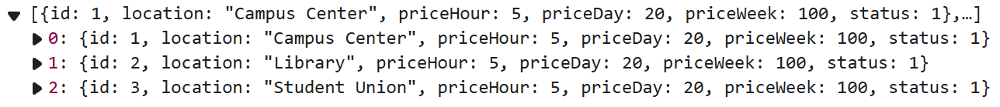
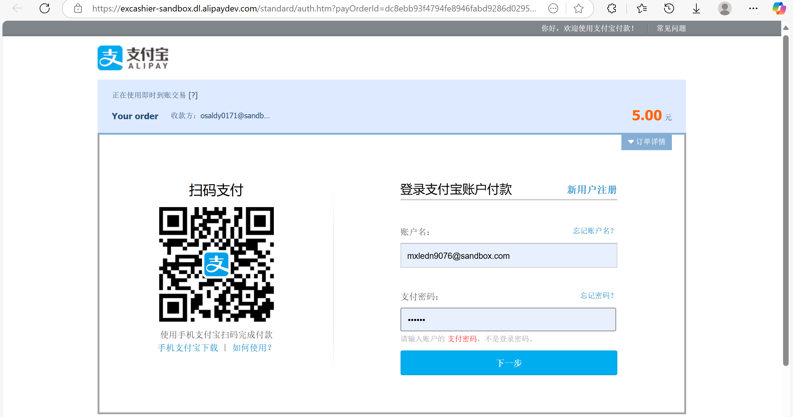
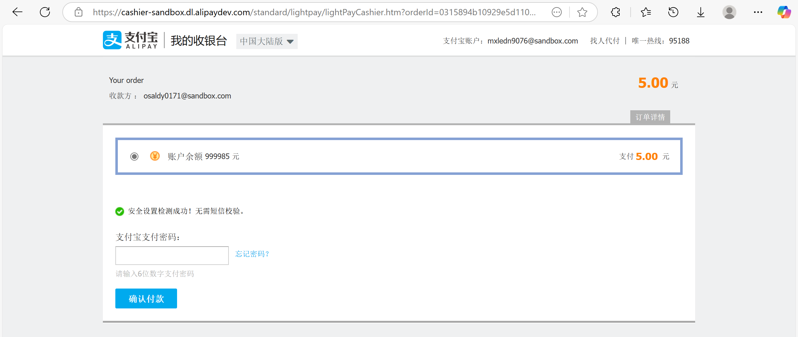
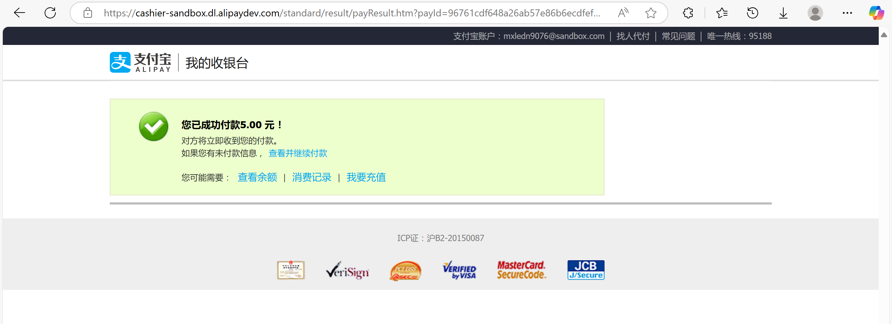
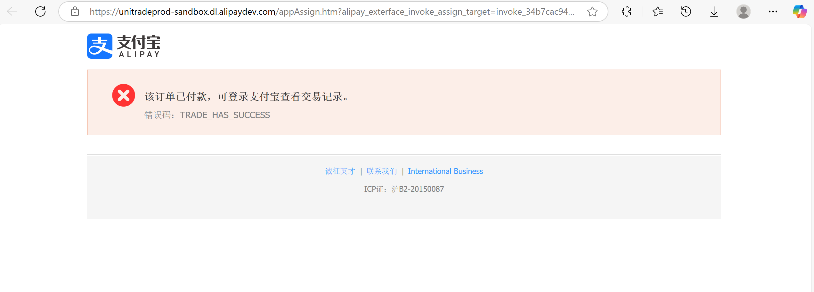
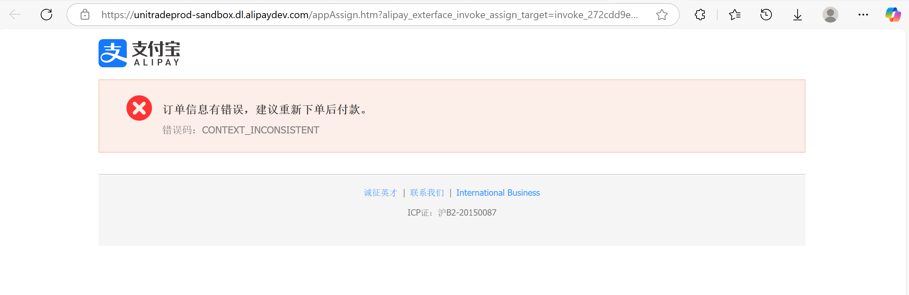
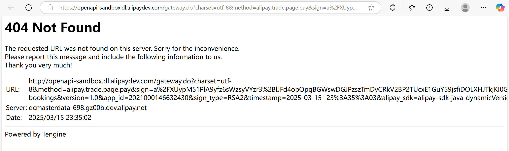
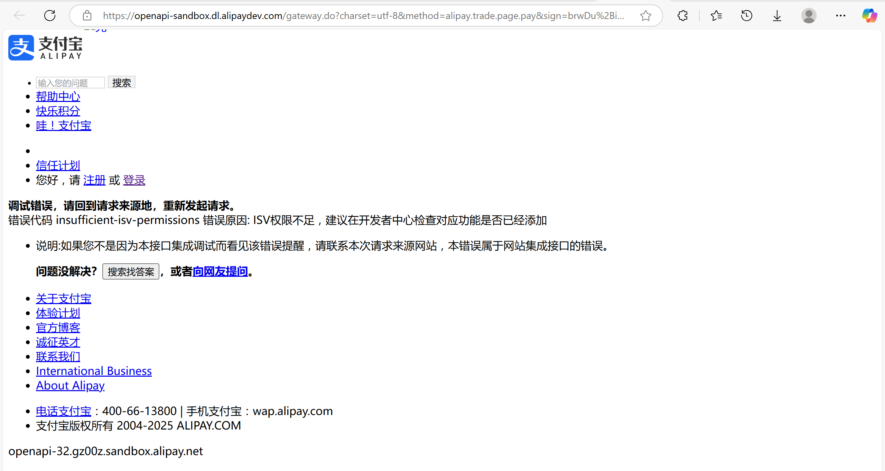

# E-Scooter Rental System

## Project Overview
A web application for renting electric scooters in the City Centre.

## Project Structure

```
.
├── frontend/    # Vue.js frontend project
└── backend/     # Spring Boot backend project
```

## Tech Stack

### Frontend
- Vue.js 3
- Vite
- Vue Router
- Axios

### Backend
- Spring Boot 3.2.2
- Spring Data JPA
- MySQL 8.0
- Maven

## Development Requirements

- Node.js 16+
- JDK 17
- Maven 3.9+
- MySQL 8.0+

## Database Setup

1. Install MySQL 8.0+
2. Create database:
```sql
CREATE DATABASE IF NOT EXISTS vuesb;
```
3. Configure database connection (in `application.properties`):
   - URL: jdbc:mysql://localhost:3306/vuesb
   - Username: root
   - Password: root

### Default account

#### Admin account
- Username: admin
- Passowrd: Password123

#### User account
- Username: user
- Password: Password123

## Running the Project

### Backend

```bash
cd backend
mvn spring-boot:run
```

Backend service will run on http://localhost:8080

### Frontend

```bash
cd frontend
npm install
npm run dev
```

Frontend service will run on http://localhost:5173

## API Documentation

### Authentication API

#### User Registration

- **URL**: `/api/auth/register`
- **Method**: `POST`
- **Request Body**:
  ```json
  {
    "username": "string",     // 3-20 characters, letters, numbers and underscore only
    "password": "string",     // Min 8 chars, must contain uppercase, lowercase and number
    "email": "string",        // Valid email format
    "mobile": "string",       // 10-13 digits
    "birthday": "date"        // Format: YYYY-MM-DD, must be in the past
  }
  ```
- **Success Response** (200 OK):
  ```json
  {
    "message": "Registration successful",
    "userId": "number",
    "username": "string",
    "token": "string"
  }
  ```
- **Error Response** (400 Bad Request):
  ```json
  {
    "username": "error message",
    "password": "error message",
    "email": "error message",
    "mobile": "error message",
    "birthday": "error message"
  }
  ```

#### User Login

- **URL**: `/api/auth/login`
- **Method**: `POST`
- **Request Body**:
  ```json
  {
    "username": "string",
    "password": "string"
  }
  ```
- **Success Response** (200 OK):
  ```json
  {
    "message": "Login successful",
    "userId": "number",
    "username": "string",
    "userType": "number",
    "email": "string",
    "token": "string"
  }
  ```
- **Error Response** (400 Bad Request):
  ```json
  {
    "username": "error message",
    "password": "error message"
  }
  ```
  或
  ```json
  "Login failed: error message"
  ```

#### Validate Token

- **URL**: `/api/auth/validate`
- **Method**: `GET`
- **Headers**:
  ```
  Authorization: Bearer {token}
  ```
- **Success Response** (200 OK):
  ```json
  {
    "valid": true,
    "userId": "number",
    "username": "string",
    "userType": "number"
  }
  ```
- **Error Response** (400 Bad Request):
  ```json
  "Invalid or missing token"
  ```
  或
  ```json
  "Invalid token"
  ```
  或
  ```json
  "Token validation failed: error message"
  ```

###User API

#### view my own bookings

- **URL**: `/api/users/orders/{userId}`

- **Method**: `GET`

- **Success Response** (200 OK):

  ```
  [
      {
          "id": 1,
          "orderTime": "2025-03-12T17:11:05.000+00:00",
          "status": 1,
          "startTime": "2025-03-12T17:20:00.000+00:00",
          "endTime": "2025-03-12T18:20:00.000+00:00",
          "hirePeriod": "HOUR",
          "price": 5.00,
          "user": {
              "id": 2,
              "username": "user",
              "password": "$2a$10$5pscTMMTiM1NoWwzL//69u7NO07t7UsAPGdeMqZvd3TQ8oEARrspG",
              "avatar": "default_avatar.jpg",
              "birthday": "1995-05-05",
              "userType": 0,
              "mobile": "9876543210",
              "email": "user@example.com",
              "paymentMethod": "paypal",
              "status": 1,
              "role": 1,
              "isFrequentUser": 0
          },
          "scooter": {
              "id": 1,
              "location": "Campus Center",
              "priceHour": 5.00,
              "priceFourHour": 10.00,
              "priceDay": 20.00,
              "priceWeek": 100.00,
              "status": 0,
              "longitude": 103.984500,
              "latitude": 30.765000
          }
      }
  ]
  ```

#### get all users

- **URL**: `/api/users/getAll`

- **Method**: `GET`

- **Success Response** (200 OK):

  ```
  [
      {
          "id": 1,
          "username": "admin",
          "password": "$2a$10$5pscTMMTiM1NoWwzL//69u7NO07t7UsAPGdeMqZvd3TQ8oEARrspG",
          "avatar": "default_avatar.jpg",
          "birthday": "1990-01-01",
          "userType": 0,
          "mobile": "1234567890",
          "email": "admin@example.com",
          "paymentMethod": "credit_card",
          "status": 1,
          "role": 0,
          "isFrequentUser": 0
      },
      {
          "id": 2,
          "username": "user",
          "password": "$2a$10$5pscTMMTiM1NoWwzL//69u7NO07t7UsAPGdeMqZvd3TQ8oEARrspG",
          "avatar": "default_avatar.jpg",
          "birthday": "1995-05-05",
          "userType": 0,
          "mobile": "9876543210",
          "email": "user@example.com",
          "paymentMethod": "paypal",
          "status": 1,
          "role": 1,
          "isFrequentUser": 0
      }
  ]
  ```

### Scooter API

#### Add scooter

- **URL**: `/api/scooters/add`

- **Method**: `POST`

- **Request Body**:
  ```json
  {
    "location": "string",
    "priceHour": "decimal",
    "priceFourHour": "decimal",
    "priceDay": "decimal",
    "priceWeek": "decimal",
    "status": "int",
    "longitude": "decimal",
    "latitude": "decimal"
  }
  ```

- **Success Response** (200 OK):
  ```json
  {
    "message": "Add successful",
    "scooterId": "int"
  }
  ```
- **Error Response** (400 Bad Request):
  ```json
  {
      "message": "error message"
  }
  ```


#### view all

**URL**: `/api/scooters/getAll`

**Method**: `Get`

**Success Response** (200 OK):



#### view one scooter

**URL**:  `/api/scooters/{id}`

**Method**: `Get`

**Success Response** (200 OK):

```
{
    id:
    location:
    priceHour:
    priceDay:
    priceWeek:
    statue:
    longitude:
    latitude:
}
```

#### change status: valid to invalid or invalid to valid

**URL**: `/api/scooters/changeStatus/{id}`

**method**:`Get`

**Success Response** (200 OK)

### Booking API

#### Create Booking

- **URL**: `/api/bookings`
- **Method**: `POST`
- **Request Body**:
  ```json
  {
    "userId": "number",       // User ID
    "scooterId": "number",    // Scooter ID
    "hireType": "string",     // One of: "HOUR", "FOUR_HOURS", "DAY", "WEEK"
    "startTime": "string"     // Format: "YYYY-MM-DD HH:mm:ss"
  }
  ```
- **Success Response** (200 OK):
  ```json
  {
    "message": "Booking successful",
    "orderId": "number",
    "startTime": "string",
    "endTime": "string",
    "price": "decimal"
  }
  ```
- **Error Response** (400 Bad Request):
  ```json
  {
    "message": "error message"  // e.g., "User not found", "Scooter not found", 
                               // "Invalid date format", "Booking time cannot be earlier than current time",
                               // "Selected time period is already booked", "Invalid hire type"
  }
  ```

#### Get Booking Timeline

- **URL**: `/api/bookings/timeline/{scooterId}`
- **Method**: `GET`
- **Path Parameters**:
  - `scooterId`: ID of the scooter
- **Success Response** (200 OK):
  ```json
  [
    {
      "startTime": "datetime",
      "endTime": "datetime",
      "status": "string",     // "booked" or "available"
      "hirePeriod": "string"  // Only present when status is "booked"
    }
  ]
  ```
- **Error Response** (400 Bad Request):
  ```json
  {
    "message": "Failed to get timeline: error message"
  }
  ```

#### Get All bookings (only admin can) 

- **URL**: `/api/bookings/getAll`

- **Method**: `GET`

- **Success Response** (200 OK):

  ```
  [
      {
          "id": 1,
          "orderTime": "2025-03-12T17:11:05.000+00:00",
          "status": 1,
          "startTime": "2025-03-12T17:20:00.000+00:00",
          "endTime": "2025-03-12T18:20:00.000+00:00",
          "hirePeriod": "HOUR",
          "price": 5.00,
          "user": {
              "id": 2,
              "username": "user",
              "password": "$2a$10$5pscTMMTiM1NoWwzL//69u7NO07t7UsAPGdeMqZvd3TQ8oEARrspG",
              "avatar": "default_avatar.jpg",
              "birthday": "1995-05-05",
              "userType": 0,
              "mobile": "9876543210",
              "email": "user@example.com",
              "paymentMethod": "paypal",
              "status": 1,
              "role": 1,
              "isFrequentUser": 0
          },
          "scooter": {
              "id": 1,
              "location": "Campus Center",
              "priceHour": 5.00,
              "priceFourHour": 10.00,
              "priceDay": 20.00,
              "priceWeek": 100.00,
              "status": 0,
              "longitude": 103.984500,
              "latitude": 30.765000
          }
      }
  ]
  ```

#### Get One booking by id

- **URL**: `/api/bookings/{orderId}`

- **Method**: `GET`

- **Path Parameters**:

  - `orderId`: ID of the order

- **An example of Success Response** (200 OK):

  ```
  {
      "id": 1,
      "orderTime": "2025-03-12T17:11:05.000+00:00",
      "status": 2,
      "startTime": "2025-03-12T17:20:00.000+00:00",
      "endTime": "2025-03-12T18:20:00.000+00:00",
      "hirePeriod": "HOUR",
      "price": 5.00,
      "user": {
          "id": 3,
          "username": "dejavu",
          "password": "$2a$10$2ECPgQqk59EEFmUb6iVeAOp8rq1tkWJlTNj1xaRyp9/vfEoYuc8Uy",
          "avatar": "default_avatar.jpg",
          "birthday": "2022-06-02",
          "userType": 0,
          "mobile": "15806120102",
          "email": "2079815209@qq.com",
          "paymentMethod": null,
          "status": 1,
          "role": 1,
          "isFrequentUser": 0
      },
      "scooter": {
          "id": 1,
          "location": "Campus Center",
          "priceHour": 5.00,
          "priceFourHour": 10.00,
          "priceDay": 20.00,
          "priceWeek": 100.00,
          "status": 0,
          "longitude": 103.984500,
          "latitude": 30.765000
      }
  }
  ```

#### Cancel booking

- **URL**: `/api/bookings/cancel/{orderId}`

- **Method**: `POST`

- **Path Parameters**:

  - `orderId`: ID of the order

- **Success Response** (200 OK):

  ```
  {
      "message": "Booking cancelled successfully"
  }
  ```


- **Error Response** (400 Bad Request):

  ```
  {
      "message": "Order is already cancelled"
  }
  ```

  ​

### Email Notifications

The system automatically sends email confirmations for successful bookings. The email includes:
- Booking confirmation message
- Order ID
- Location
- Start and end times
- Rental duration
- Rental fee
- Contact information

### Feedback API

#### Create Feedback

- **URL**: `/api/feedback`
- **Method**: `POST`
- **Headers**:
  ```
  Authorization: Bearer {token}
  ```
- **Request Body**:
  ```json
  {
    "content": "string"    // Feedback content
  }
  ```
- **Success Response** (200 OK):
  ```json
  {
    "id": "number",
    "userId": "number",
    "content": "string",
    "createTime": "datetime",
    "status": "string",      // "pending", "processing", or "resolved"
    "priority": "number",    // 0: low, 1: medium, 2: high
    "adminResponse": "string",
    "responseTime": "datetime"
  }
  ```
- **Error Response** (400 Bad Request):
  ```json
  {
    "message": "Failed to create feedback: error message"
  }
  ```
- **Error Response** (401 Unauthorized):
  ```json
  {
    "error": "No access authorization"
  }
  ```

#### Get User's Feedbacks

- **URL**: `/api/feedback/user`
- **Method**: `GET`
- **Headers**:
  ```
  Authorization: Bearer {token}
  ```
- **Success Response** (200 OK):
  ```json
  [
    {
      "id": "number",
      "userId": "number",
      "content": "string",
      "createTime": "datetime",
      "status": "string",
      "priority": "number",
      "adminResponse": "string",
      "responseTime": "datetime"
    }
  ]
  ```
- **Error Response** (400 Bad Request):
  ```json
  {
    "message": "Failed to get feedbacks: error message"
  }
  ```
- **Error Response** (401 Unauthorized):
  ```json
  {
    "error": "No access authorization"
  }
  ```

#### Get All Feedbacks (Admin Only)

- **URL**: `/api/feedback/all`
- **Method**: `GET`
- **Headers**:
  ```
  Authorization: Bearer {token}
  ```
- **Success Response** (200 OK):
  ```json
  [
    {
      "id": "number",
      "userId": "number",
      "content": "string",
      "createTime": "datetime",
      "status": "string",
      "priority": "number",
      "adminResponse": "string",
      "responseTime": "datetime"
    }
  ]
  ```
- **Error Response** (401 Unauthorized):
  ```json
  {
    "error": "No access authorization"
  }
  ```
- **Error Response** (403 Forbidden):
  ```json
  {
    "error": "Permission denied"
  }
  ```

#### Update Feedback (Admin Only)

- **URL**: `/api/feedback/{id}`
- **Method**: `PUT`
- **Headers**:
  ```
  Authorization: Bearer {token}
  ```
- **Request Body**:
  ```json
  {
    "priority": "number",      // Optional, 0: low, 1: medium, 2: high
    "status": "string",        // Optional, "pending", "processing", or "resolved"
    "adminResponse": "string"  // Optional, admin's response to the feedback
  }
  ```
- **Success Response** (200 OK):
  ```json
  {
    "id": "number",
    "userId": "number",
    "content": "string",
    "createTime": "datetime",
    "status": "string",
    "priority": "number",
    "adminResponse": "string",
    "responseTime": "datetime"
  }
  ```
- **Error Response** (401 Unauthorized):
  ```json
  {
    "error": "No access authorization"
  }
  ```
- **Error Response** (403 Forbidden):
  ```json
  {
    "error": "Permission denied"
  }
  ```
- **Error Response** (400 Bad Request):
  ```json
  {
    "message": "Failed to update feedback: error message"
  }
  ```

### Pay Api 

#### web端

- **URL**: `/api/alipay/pay/{orderId}`

- **Method**: `GET`

- **Headers**:

  ```
  Authorization: Bearer {token}
  ```


- **Success**:

  ```
  <form name="punchout_form" method="post" action="https://openapi-sandbox.dl.alipaydev.com/gateway.do?charset=utf-8&method=alipay.trade.page.pay&sign=eONdSePeKIbGT2V0ZD6jt8WMEpBYxRu3nbjzIEv%2FdUIbLaIsT0ACiWhl9ewMM1rFuCdGmeDKDObFf8REFcCR4iTWt20%2Fm2GXUU0gX00tpRiWLEdecZnE%2Fx1O%2BujtYLfcDmoPetxZjjKafrkJkY4Z65Z%2FKzHIT0CyE0PbRQpgwZlm%2FO9lpvbgYYnd3Ds8kDux4RpnTlSlE5Gn4obDcaGUYt7CmFvPeUawak%2BaBIFGzSxT6OxDZtrXEqdPDXtSR2Nd5OiUN336YIdsPj9lK5HUUnKW2m0NdceltbR60wT6Lpqgm8JkKfAecsFTNurXAguHJwZSLDn4cXJNOihyvIjAvQ%3D%3D&return_url=http%3A%2F%2Flocalhost%3A5173%2Fmy-bookings&version=1.0&app_id=2021000146632430&sign_type=RSA2&timestamp=2025-03-24+15%3A46%3A21&alipay_sdk=alipay-sdk-java-dynamicVersionNo&format=JSON">
      <input type="hidden" name="biz_content" value="{&quot;body&quot;:&quot;This is your rent order&quot;,&quot;out_trade_no&quot;:&quot;1&quot;,&quot;product_code&quot;:&quot;FAST_INSTANT_TRADE_PAY&quot;,&quot;subject&quot;:&quot;Your order&quot;,&quot;total_amount&quot;:&quot;5.00&quot;}">
      <input type="submit" value="立即支付" style="display:none">
  </form>
  <script>
      document.forms[0].submit();
  </script>
  ```

  ​

情况一：如果订单还没有被支付（沙盒支付自己会判断），网址会自动跳转到如下支付页面

账户名：mxledn9076@sandbox.com

密码：111111



点击下一步，会继续跳转，再次输入密码111111



继续自动跳转，如下



过几秒后再次自动跳转，至全部订单页面（这个页面后续要改，改成个人中心全部订单的http）


情况二：如果orderId对应的订单已经被支付，网址会自动跳转到支付宝沙盒支付的固定页面，如下

**Fail**: 有时会失败，如下图3种情况，是自动跳转不稳定，刷新即可







#### App端

- **URL**: `/api/alipay/appPay/{orderId}`

- **Method**: `GET`

- **Headers**:

  ```
  Authorization: Bearer {token}

  ```


- **Success**:

```
alipay_sdk=alipay-sdk-java-dynamicVersionNo&app_id=2021000146632430&biz_content=%7B%22body%22%3A%22This+is+your+rent+order%22%2C%22out_trade_no%22%3A%221%22%2C%22product_code%22%3A%22FAST_INSTANT_TRADE_PAY%22%2C%22subject%22%3A%22Your+order%22%2C%22total_amount%22%3A%225.00%22%7D&charset=utf-8&format=JSON&method=alipay.trade.app.pay&return_url=http%3A%2F%2Flocalhost%3A5173%2Fmy-bookings&sign=fU9opIqEPq6yLErRgFAmDeaphmPr06Px1CeSq7s5yT8mS2ycdENv2plpjwrh4%2BZn1XKLTCzcCpLw61Zq%2FW%2BxhQ0ODFTCVAKGxaLUS7Q0%2Bznc%2B7LqbYLVqtw3narA%2FcyAfbSy3mPa3r9TOY6jmy5%2FGVPc1JK%2BV6it1LlLVNzJMA%2Fa07sLsAgGYaVsWiBe1IwBxZYfzFfIoPGDwdRasWJdTgNYd4Mimf3IjAD41j0614TRdQLsk90ScvrhLktdY35bP7KbkmHG%2Bv79KWDXkJ5qEMEcKNLc3uShi5cWEnJy3zNeiq7KSWoIqrr9GxAfN%2F9DyoJ69pansjan%2FvzAvvlv9g%3D%3D&sign_type=RSA2&timestamp=2025-03-25+11%3A56%3A33&version=1.0
```

### Weekly Revenue API

#### Get Current Week Revenue

- **URL**: `/api/weekly-revenue/current`
- **Method**: `GET`
- **Headers**:
  ```
  Authorization: Bearer {token}
  ```
- **Success Response** (200 OK):
  ```json
  {
    "id": "number",
    "weekStartDate": "datetime",
    "weekEndDate": "datetime",
    "hourlyRevenue": "decimal",
    "fourHoursRevenue": "decimal",
    "dailyRevenue": "decimal",
    "weeklyRevenue": "decimal",
    "totalRevenue": "decimal",
    "ordersCount": "number",
    "createdAt": "datetime",
    "updatedAt": "datetime"
  }
  ```
- **Error Response** (401 Unauthorized):
  ```json
  {
    "error": "No access authorization"
  }
  ```
- **Error Response** (403 Forbidden):
  ```json
  {
    "error": "Permission denied"
  }
  ```

#### Get Revenue by Date

- **URL**: `/api/weekly-revenue/by-date`
- **Method**: `GET`
- **Headers**:
  ```
  Authorization: Bearer {token}
  ```
- **Query Parameters**:
  - `date`: Date in format "YYYY-MM-DD"
- **Success Response** (200 OK):
  ```json
  {
    "id": "number",
    "weekStartDate": "datetime",
    "weekEndDate": "datetime",
    "hourlyRevenue": "decimal",
    "fourHoursRevenue": "decimal",
    "dailyRevenue": "decimal",
    "weeklyRevenue": "decimal",
    "totalRevenue": "decimal",
    "ordersCount": "number",
    "createdAt": "datetime",
    "updatedAt": "datetime"
  }
  ```
- **Error Response** (400 Bad Request):
  ```json
  {
    "message": "Invalid date format"
  }
  ```
- **Error Response** (401 Unauthorized):
  ```json
  {
    "error": "No access authorization"
  }
  ```
- **Error Response** (403 Forbidden):
  ```json
  {
    "error": "Permission denied"
  }
  ```

#### Get Recent Weekly Revenues

- **URL**: `/api/weekly-revenue/recent`
- **Method**: `GET`
- **Headers**:
  ```
  Authorization: Bearer {token}
  ```
- **Query Parameters**:
  - `weeks`: Number of weeks to retrieve (default: 4)
- **Success Response** (200 OK):
  ```json
  [
    {
      "id": "number",
      "weekStartDate": "datetime",
      "weekEndDate": "datetime",
      "hourlyRevenue": "decimal",
      "fourHoursRevenue": "decimal",
      "dailyRevenue": "decimal",
      "weeklyRevenue": "decimal",
      "totalRevenue": "decimal",
      "ordersCount": "number",
      "createdAt": "datetime",
      "updatedAt": "datetime"
    }
  ]
  ```
- **Error Response** (401 Unauthorized):
  ```json
  {
    "error": "No access authorization"
  }
  ```
- **Error Response** (403 Forbidden):
  ```json
  {
    "error": "Permission denied"
  }
  ```

#### Get Revenue by Date Range

- **URL**: `/api/weekly-revenue/range`
- **Method**: `GET`
- **Headers**:
  ```
  Authorization: Bearer {token}
  ```
- **Query Parameters**:
  - `startDate`: Start date in format "YYYY-MM-DD"
  - `endDate`: End date in format "YYYY-MM-DD"
- **Success Response** (200 OK):
  ```json
  [
    {
      "id": "number",
      "weekStartDate": "datetime",
      "weekEndDate": "datetime",
      "hourlyRevenue": "decimal",
      "fourHoursRevenue": "decimal",
      "dailyRevenue": "decimal",
      "weeklyRevenue": "decimal",
      "totalRevenue": "decimal",
      "ordersCount": "number",
      "createdAt": "datetime",
      "updatedAt": "datetime"
    }
  ]
  ```
- **Error Response** (400 Bad Request):
  ```json
  {
    "message": "Invalid date format"
  }
  ```
- **Error Response** (401 Unauthorized):
  ```json
  {
    "error": "No access authorization"
  }
  ```
- **Error Response** (403 Forbidden):
  ```json
  {
    "error": "Permission denied"
  }
  ```

#### Manually Update Weekly Revenue

- **URL**: `/api/weekly-revenue/update`
- **Method**: `POST`
- **Headers**:
  ```
  Authorization: Bearer {token}
  ```
- **Success Response** (200 OK):
  ```json
  {
    "message": "Weekly revenue updated successfully"
  }
  ```
- **Error Response** (401 Unauthorized):
  ```json
  {
    "error": "No access authorization"
  }
  ```
- **Error Response** (403 Forbidden):
  ```json
  {
    "error": "Permission denied"
  }
  ```

## Validation Rules

b_user

### Username

- Length: 3-20 characters
- Allowed characters: letters, numbers, underscore
- Special characters not allowed

### Password
- Minimum length: 8 characters
- Must contain:
  - At least one uppercase letter
  - At least one lowercase letter
  - At least one number

### Email
- Must be valid email format
- Cannot be already registered

### Mobile Number
- Length: 10-13 digits
- Numbers only

### Birthday
- Must be valid date format (YYYY-MM-DD)
- Cannot be a future date

### b_scooter table

#### longitude and latitude

Integers have a maximum of three digits, and decimal places have a maximum of 6 digits

#### price per hour/day/week

- Integers have a maximum of three digits, and decimal places have a maximum of two digits